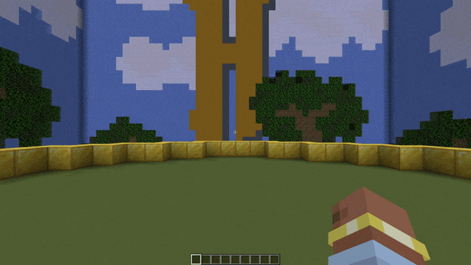
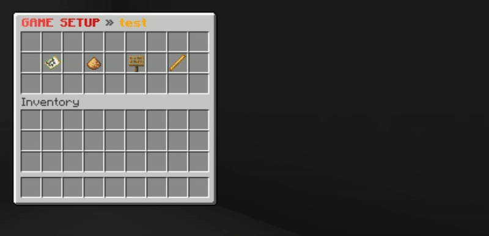
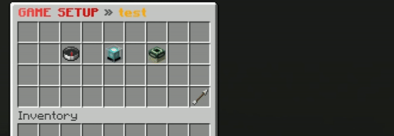
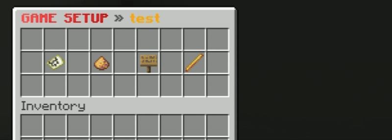
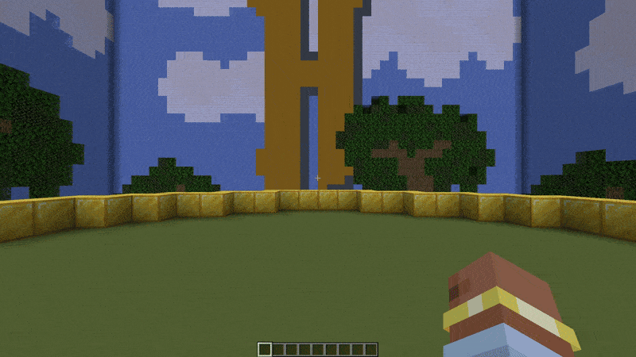

import { Aside, Badge } from '@astrojs/starlight/components';

Setting up an arena in Santa Says is done through an intuitive in-game GUI. This guide will walk you through the process from the initial command to the final registration.

---

## Step 1: Create the Arena
<details>
    <summary>📸 Watch: How to create an arena</summary>

    

</details>

To begin, you need to initialize a new arena instance. Each arena must have a **unique ID**.

```bash
/santasays create <arena_id>
```

<Aside type="caution">
    If the ID is already in use, you will receive an error message. Choose a name that is easy to remember (e.g., `winter_1`).
</Aside>

---

## Step 2: Open the Setup Menu
<details>
    <summary>📸 Watch: Opening the setup menu</summary>

    

</details>

Once the arena is created, enter the Edit Mode to access the configuration GUI.

```bash
/santasays edit <arena_id>
```

This command opens the main setup menu where all configurations are handled.

---

## Step 3: Configure Game Locations
<details>
    <summary>📸 Watch: Setting teleport locations</summary>

    

</details>

Click on the **Arena Locations** (`FILLED_MAP`) item in the main menu to set the teleportation points.

* **Lobby** (`COMPASS`): The location where players are teleported when they join the arena and wait for the game to start.
* **Start Location** (`BEACON`): The specific point where players are teleported the moment the game loop begins.
* **End Location** (`END_PORTAL_FRAME`): The location where players are sent after the game ends or if they leave.

<Aside type="tip">
    You can use the **Go Back** (`REDSTONE`) item to return to the main setup menu at any time.
</Aside>

---

## Step 4: Set Player Amounts <Badge text="Optional" variant="tip" />
<details>
    <summary>📸 Watch: Adjusting player limits</summary>

    

</details>

From the main menu, click on **Player Amounts** (`GLOWSTONE_DUST`) to define the arena's capacity.

* **Minimum Players**: How many players are needed to start the lobby countdown.
* `LEFT CLICK` to increase | `RIGHT CLICK` to decrease.
* **Maximum Players**: The total capacity of the arena.
* `LEFT CLICK` to increase | `RIGHT CLICK` to decrease.

---

## Step 5: Select the Game Platform
<details>
    <summary>📸 Watch: Using the selection wand</summary>

    

</details>

The **Platform Selector** (`BLAZE_ROD`) is used to define the playable area where tasks will take place.

The platform is strictly **2D** (flat). Use the wand to add or remove blocks from your game arena.

### Wand Controls

| Action            | Control                                   | Description                                                                                                                               |
|:------------------|:------------------------------------------|:------------------------------------------------------------------------------------------------------------------------------------------|
| **Add Area**      | <kbd>Left Click</kbd>                     | Selects the corners to **ADD** a rectangular region to the platform.                                                                      |
| **Remove Area**   | <kbd>Right Click</kbd>                    | Selects the corners to **REMOVE** a rectangular region from the platform.                                                                 |
| **Add Single**    | <kbd>Shift</kbd> + <kbd>Left Click</kbd>  | **ADDS** the single block you are looking at to the platform.                                                                             |
| **Remove Single** | <kbd>Shift</kbd> + <kbd>Right Click</kbd> | **REMOVES** the single block you are looking at from the platform.                                                                        |
| **Visualizer**    | <kbd>Middle Click</kbd>                   | Toggles the **Particle Visualizer**. This highlights all currently selected platform blocks with particles so you can see the boundaries. |
| **Clear All**     | <kbd>Drop (Q)</kbd>                       | **Resets the entire platform**. Removes all selected blocks from the configuration.                                                       |

<Aside type="caution">
    **Be Careful with "Drop"!**
    Pressing the Drop key (`Q` by default) will instantly **clear all** platform data for this arena. Only use this if you want to start over from scratch.
</Aside>

---

### Visualizer Mode
Building a perfect platform can be tricky. The **Visualizer Mode** helps you see exactly which blocks are currently part of your arena.

* **How to Toggle:** Open the arena setup menu, hover over the **Selection Wand** item, and press **Middle Click**.

This highlights the boundaries of your platform, making it easy to spot missing blocks or accidental selections without having to guess.

<Aside type="tip">
    You can keep the Visualizer **enabled** while adding or removing blocks! The glowing outline will update instantly as you modify the arena.
</Aside>

---

## Step 6: Create an Arena Sign <Badge text="Optional" variant="tip" />
<details>
    <summary>📸 Watch: Linking a sign</summary>

    

</details>

Look directly at a sign and click the **Create Arena Sign** (`OAK_SIGN`) item. This will link the sign to your arena.

The sign will automatically update its status (Waiting, Starting, In-Game, Ending) and display the current player count.

---

## Step 7: Register the Arena
<details>
    <summary>📸 Watch: Finalizing the arena</summary>

    

</details>

Once you have configured all locations, player amounts, and the platform, it’s time to finalize.

Click the **Register the Arena** (`FIREWORK`) item. The plugin will validate your settings and, if everything is correct, the arena will be activated and ready for players!

---

## Joining the Game
After successfully registering your arena, players can join the action in two ways:

1. **By Command:** Use `/santasays join <arena_id>` to enter the lobby.
2. **By Sign:** If you created an `Arena Sign in Step 6`, simply **Right-Click** the sign to join.

---

## Summary Table
| Item             | Name              | Function                                  |
|:-----------------|:------------------|:------------------------------------------|
| `FILLED_MAP`     | Arena Locations   | Set Lobby, Start, and End points.         |
| `GLOWSTONE_DUST` | Player Amounts    | Set Min and Max player limits.            |
| `BLAZE_ROD`      | Platform Selector | Define the game area with a Wand.         |
| `OAK_SIGN`       | Create Sign       | Link a physical sign to the arena status. |
| `FIREWORK`       | Register          | Save and activate the arena.              |