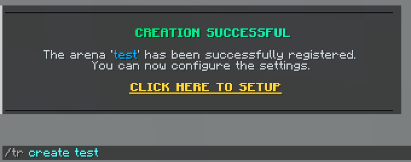
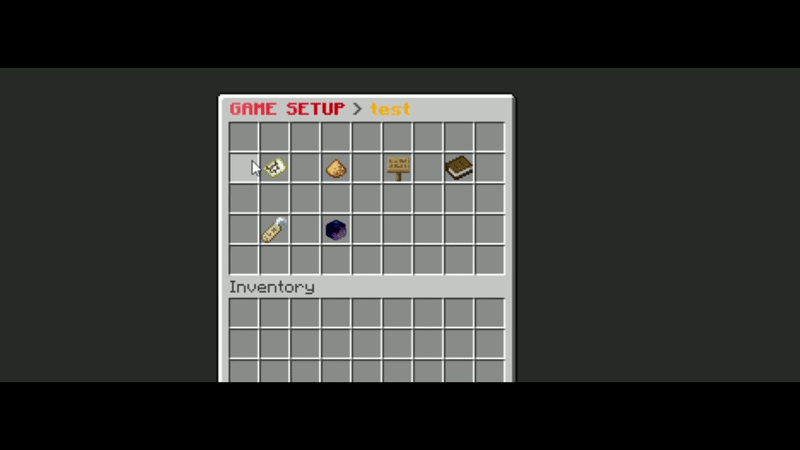
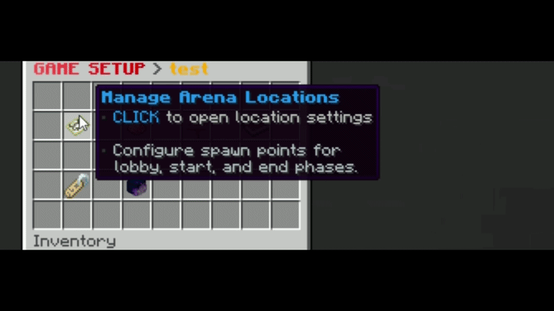
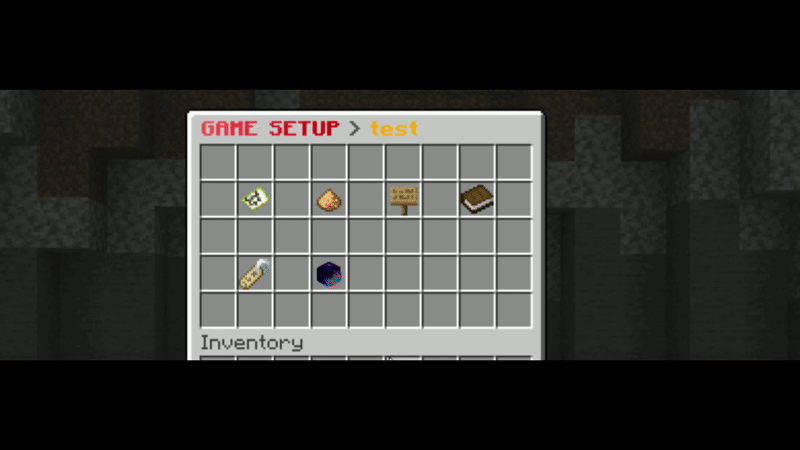
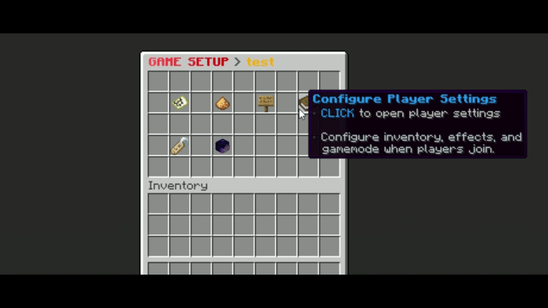
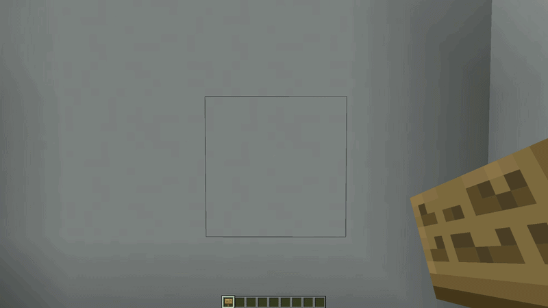
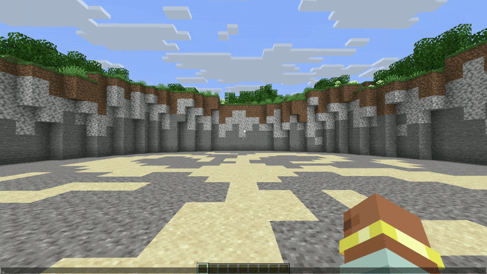

import { Aside, Steps, Badge } from "@astrojs/starlight/components";

Setting up an arena in **TNT Run** is done through an intuitive in-game GUI. This guide will walk you through the process from the initial command to the final registration.

---

## Step 1: Create the Arena
<details>
    <summary>📸 Preview: How to create an arena</summary>

    

</details>

To begin, you need to initialize a new arena instance. Each arena must have a **unique ID**.

```bash
/tntrun create <arena_id>
```

<Aside type="caution">
    If the ID is already in use, you will receive an error message. Choose a name that is easy to remember (e.g., `winter_1`).
</Aside>
---

## Step 2: Open the Setup Menu
<details>
    <summary>📸 Watch: Opening the setup menu</summary>

    

</details>

Once the arena is created, enter the Edit Mode to access the configuration GUI.

```bash
/tntrun edit <arena_id>
```

This command opens the main setup menu where all configurations are handled.

---

## Step 3: Configure Game Locations
<details>
    <summary>📸 Watch: Setting teleport locations</summary>

    

</details>

Click on the **Arena Locations** (`FILLED_MAP`) item in the main menu to set the teleportation points.

* **Lobby** (`LODESTONE`): The location where players are teleported when they join the arena and wait for the game to start.
* **Start Location** (`BEACON`): The specific point where players are teleported the moment the game loop begins.
* **End Location** (`END_PORTAL_FRAME`): The location where players are sent after the game ends or if they leave.

<Aside type="tip">
    You can use the **Go Back** (`ARROW`) item to return to the main setup menu at any time.
</Aside>

---

## Step 4: Set Player Amounts <Badge text="Optional" variant="tip" />
<details>
    <summary>📸 Watch: Adjusting player limits</summary>

    

</details>

From the main menu, click on **Player Amounts** (`GLOWSTONE_DUST`) to define the arena's capacity.

* **Minimum Players**: How many players are needed to start the lobby countdown.
  * `LEFT CLICK` to increase | `RIGHT CLICK` to decrease.
* **Maximum Players**: The total capacity of the arena.
  * `LEFT CLICK` to increase | `RIGHT CLICK` to decrease.

---

## Step 5: Set Optional Settings <Badge text="Optional" variant="tip" />
<details>
    <summary>📸 Watch: Setting optional settings</summary>

    

</details>

| Setting | Description |
|:--|:--|
| **Map Details** | Map name, author, and difficulty used in scoreboards, signs, messages, and placeholders. |
| **Scoreboard Toggle** | Enables or disables the scoreboard for this arena. |
| **Bossbar Toggle** | Enables or disables boss bars for this arena. |
| **Potion Effects** | Applies configured effects to players when the in-game phase starts. |

---

## Step 6: Create an Arena Sign <Badge text="Optional" variant="tip" />
<details>
    <summary>📸 Watch: Linking a sign</summary>

    

</details>

Look directly at a sign and click the **Create Arena Sign** (`OAK_SIGN`) item. This will link the sign to your arena.

The sign will automatically update its status (Waiting, Starting, In-Game, Ending) and display the current player count.

---


## Step 7: Register the Arena
<details>
    <summary>📸 Watch: Finalizing the arena</summary>

    

</details>

Once you have configured all required locations and player amounts, it's time to finalize.

Click the **Register the Arena** (`FIREWORK_ROCKET`) item. The plugin will validate your settings and, if everything is correct, the arena will be activated and ready for players!

---

## Joining the Game
After successfully registering your arena, players can join the action in two ways:

1. **By Command:** Use `/tntrun join <arena_id>` to enter the lobby.
2. **By Sign:** If you created an `Arena Sign in Step 6`, simply **Right-Click** the sign to join.

---

## Summary Table
| Item              | Name                      | Function                                        |
|:------------------|:--------------------------|:------------------------------------------------|
| `FILLED_MAP`      | Manage Arena Locations    | Open Lobby, Start, and End location settings.   |
| `GLOWSTONE_DUST`  | Player Amounts            | Configure minimum and maximum player limits.    |
| `OAK_SIGN`        | Create Arena Sign         | Link a physical sign to the arena status.       |
| `BOOK`            | Configure Player Settings | Configure player inventory, effects, and mode.  |
| `PLAYER_HEAD`     | Reset Arena Records       | Clear this arena's stored best-time records.    |
| `FIREWORK_ROCKET` | Register the Arena        | Validate, save, and activate the arena.         |
