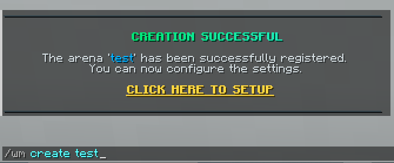
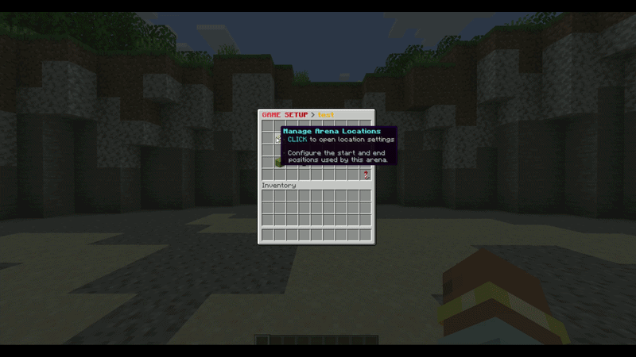
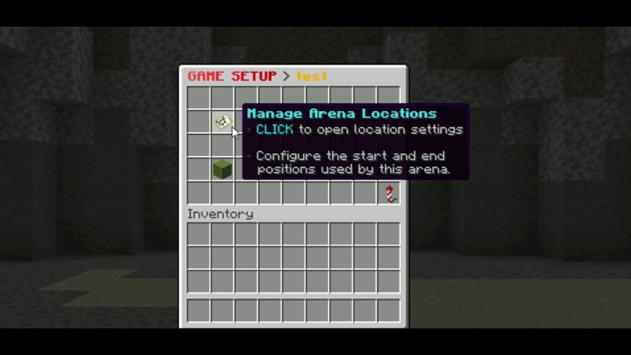
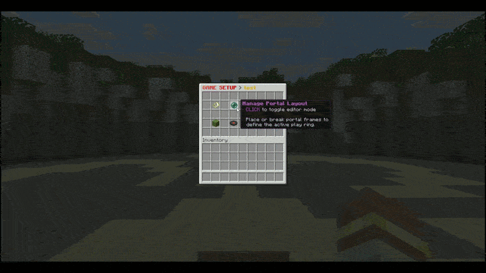
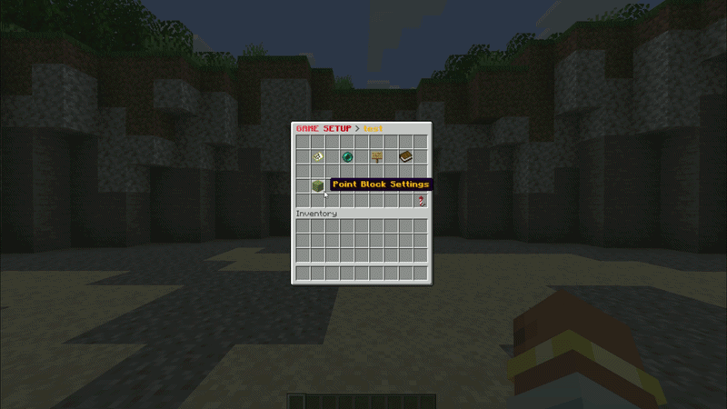
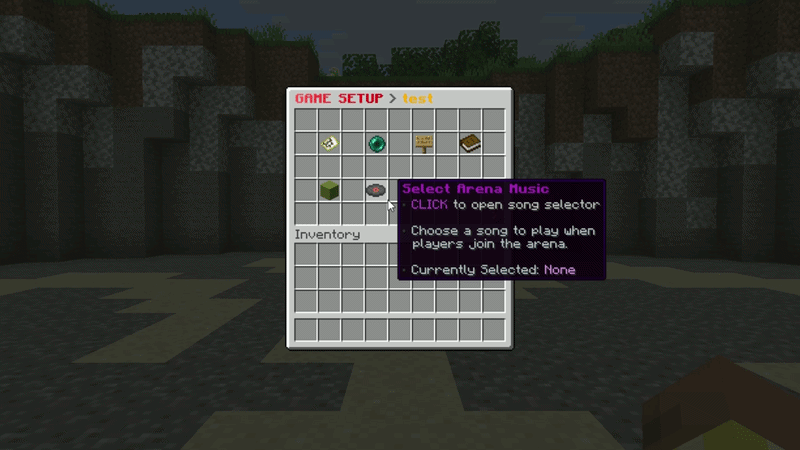
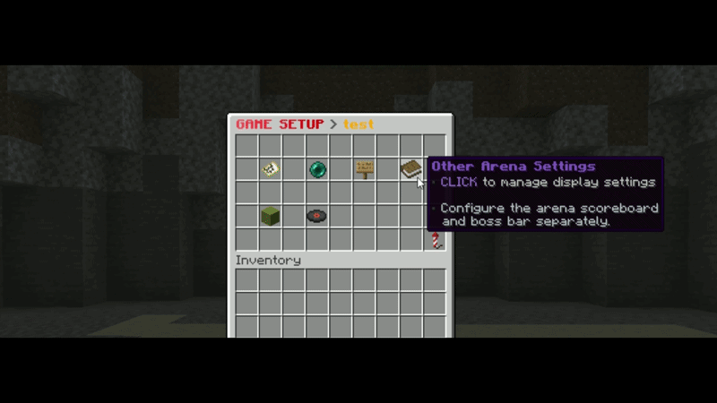
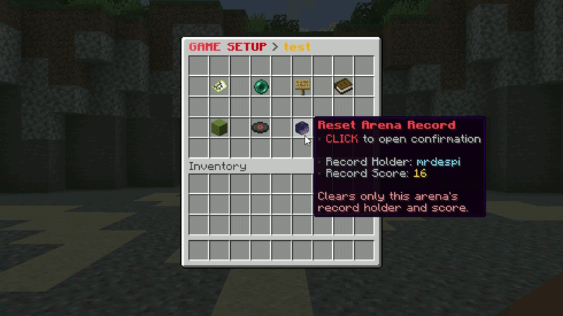
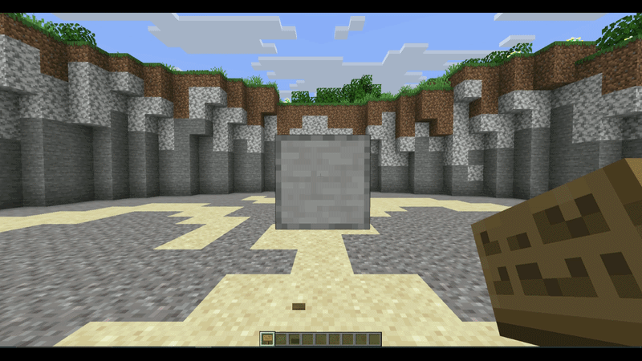

import { Aside, Badge, Steps } from "@astrojs/starlight/components";

Whack Me arenas are configured through the interactive menu opened with `/wm edit <arena>`. This guide follows the entire workflow from creation to a playable, registered arena.

---

## Step 1: Create the Arena

<details>
    <summary>📸 Preview: Creating an arena</summary>

    

</details>

Create a new arena with a unique, stable ID:

```bash
/wm create <arena_id>
```

Use IDs such as `arcade_1` or `castle_whack`. The ID is reused by join commands, placeholders, setup output, and saved data.

---

## Step 2: Open the Setup Menu

<details>
    <summary>📸 Watch: Opening the setup menu</summary>

    

</details>

```bash
/wm edit <arena_id>
```

The home page provides access to locations, portal layout editing, point-block settings, music, display toggles, arena records, signs, and final registration.

---

## Step 3: Set Start and End Locations

<details>
    <summary>📸 Watch: Configuring arena locations</summary>

    

</details>

Open **Manage Arena Locations** (`FILLED_MAP`). Both locations are required.

### Start Location

* **Click:** Saves your exact position. In the normal layout mode, you must already be surrounded by end portal frames.
* **Shift-click:** Centers the saved position on the current block and automatically places end portal frames in the eight surrounding positions.

When the plugin detects the surrounding frame ring, those eight blocks become the arena's portal locations automatically.

### End Location

* **Click:** Saves your exact position.
* **Shift-click:** Centers the position on the current block.

The end location is used after normal finishes, leaves, kicks, cancellations, and reconnect recovery.

---

## Step 4: Define the Portal Layout

<details>
    <summary>📸 Watch: Building a custom portal layout</summary>

    

</details>

Portal locations are the positions from which point blocks rise. Use the automatic eight-frame ring from the start-location action, or click **Manage Portal Layout** (`ENDER_PEARL`) to build a custom layout.

In Portal Editing Mode:

1. Your inventory is saved and replaced with end portal frames plus a barrier.
2. Place frames to add point-block positions.
3. Break frames to remove positions.
4. Use the barrier to leave editing mode, save the new list, and restore your inventory.

<Aside type="caution">
    Registration requires at least one portal location. In practice, use several well-spaced frames so multiple blocks can be visible and reachable at once.
</Aside>

---

## Step 5: Open Point-Block Settings

<details>
    <summary>📸 Watch: Opening and navigating point-block settings</summary>

    

</details>

The **Point Block Settings** entry unlocks after portal locations exist. It opens a dialog with arena-specific spawning, movement, and appearance controls.

| Setting | Default | Allowed range | Purpose |
|:--|:--|:--|:--|
| Minimum active blocks | `4` | `1` to portal count | Lowest target number of simultaneously visible blocks. |
| Maximum active blocks | `8` | `1` to portal count | Hard cap on simultaneously visible blocks. |
| Vertical movement step | `0.05` | `0.01` to `0.20` | Distance moved per tick; higher is faster. |
| Maximum vertical step | `0.64` | `0.01` to `1.00` | Safety cap applied to the movement step. |
| Peak wait | `12` ticks | `0` to `40` | Time the block waits at its highest point. |
| Spawn check period | `8` ticks | `1` to `20` | Delay between checks that replace missing point blocks. |
| Asynchronous movement | Disabled | On or off | Moves point-block animation outside the main thread; cleanup remains synchronous. |

---

## Step 6: Set Active Block Amounts

<details>
    <summary>📸 Watch: Adjusting minimum and maximum point blocks</summary>

    

</details>

Choose **Active Block Limits** to edit the minimum and maximum together. Both are capped by the number of portal locations. If the maximum is set below the minimum, Whack Me raises it to match; changing either value individually also keeps the pair valid.

<Aside type="tip">
    More simultaneous blocks increase visual load and decision pressure. Start with `4–8`, then test the layout from a player's viewing angle.
</Aside>

### Customize Block Appearance <Badge text="Optional" variant="tip" />

Use **Customize Point Block Looks** to assign the green, red, and gray hit-state items. Put an item on your cursor and click the corresponding preview slot. Blocks, player heads, and custom item metadata are supported, and the saved stack amount is normalized to one.

---

## Step 7: Select Arena Music <Badge text="Optional" variant="tip" />

<details>
    <summary>📸 Watch: Selecting and previewing a song</summary>

    

</details>

If NoteBlockAPI is installed, **Select Arena Music** lists every valid `.nbs` file in `/plugins/WhackMe/musics/`.

* **Left-click:** Select the song for this arena.
* **Right-click:** Preview the song for yourself.
* **No Song:** Clear the arena's selection.

Whack Me includes five starter songs and repeats the selected song while a player occupies the arena. See **[NoteBlockAPI Music](/whack-me/music/note-block-api)** for installation and custom files.

---

## Step 8: Configure Other Settings <Badge text="Optional" variant="tip" />

<details>
    <summary>📸 Watch: Toggling arena display settings</summary>

    

</details>

The **Other Arena Settings** page controls two independent per-arena options:

* **Arena Scoreboard:** Enables the live scoreboard for this arena. The global `scoreboard-enabled` option must also be enabled.
* **Arena Boss Bar:** Enables the configured timer-progress boss bar for this arena. `bossbar.yml` must also have `enabled: true`.

Changes apply immediately if that arena currently has a running game.

---

## Step 9: Reset an Arena Record <Badge text="Optional" variant="tip" />

<details>
    <summary>📸 Watch: Resetting an arena record safely</summary>

    

</details>

After an arena has a record, **Reset Arena Record** shows its holder and score. The confirmation page prevents accidental deletion. Confirming resets only that arena's global holder to `None` and score to `0`; it does not erase player statistics or personal records.

---

## Step 10: Create a Join Sign <Badge text="Optional" variant="tip" />

<details>
    <summary>📸 Watch: Linking a join sign</summary>

    

</details>

Place a sign, look directly at it, and click **Create Arena Sign** (`OAK_SIGN`). Whack Me registers, formats, and waxes the sign. Its state updates automatically, and players can right-click it to join.

Breaking a registered sign requires `whackme.sign.break`. See **[signs.yml](/whack-me/configuration/signs)** to customize the four lines and state labels.

---

## Step 11: Register the Arena

Click **Register the Arena** (`FIREWORK`) when setup is complete. Whack Me verifies these required values in order:

1. Start location
2. End location
3. At least one portal location

If a value is missing, registration stops and names the missing option. On success, the arena becomes ready, starts its waiting runtime, and the success message includes a clickable `/wm join <arena>` action.

<Aside type="note">
    Arena data is saved automatically and during shutdown. If critical saved locations are missing on a later startup, Whack Me automatically marks the arena as not ready instead of starting a broken game.
</Aside>

---

## Joining the Game

Players can now start a run in either way:

1. `/wm join <arena_id>`
2. Right-click the registered arena sign

An arena accepts one player at a time. If occupied, other players must use another arena or wait until the run finishes.

---

## Setup Menu Summary

| Item | Name | Function |
|:--|:--|:--|
| `FILLED_MAP` | Manage Arena Locations | Set the required start and end points. |
| `ENDER_PEARL` / `ENDER_EYE` | Manage Portal Layout | Enter or leave the custom portal-frame editor. |
| `LIME_TERRACOTTA` | Point Block Settings | Configure amounts, animation, spawn checks, and appearances. |
| `MUSIC_DISC_BLOCKS` | Select Arena Music | Select, preview, or clear an NBS song. |
| `BOOK` | Other Arena Settings | Toggle the scoreboard and boss bar for this arena. |
| `PLAYER_HEAD` | Reset Arena Record | Clear this arena's global holder and score after confirmation. |
| `OAK_SIGN` | Create Arena Sign | Link the sign being viewed to the arena. |
| `FIREWORK` | Register the Arena | Validate and activate the arena. |
